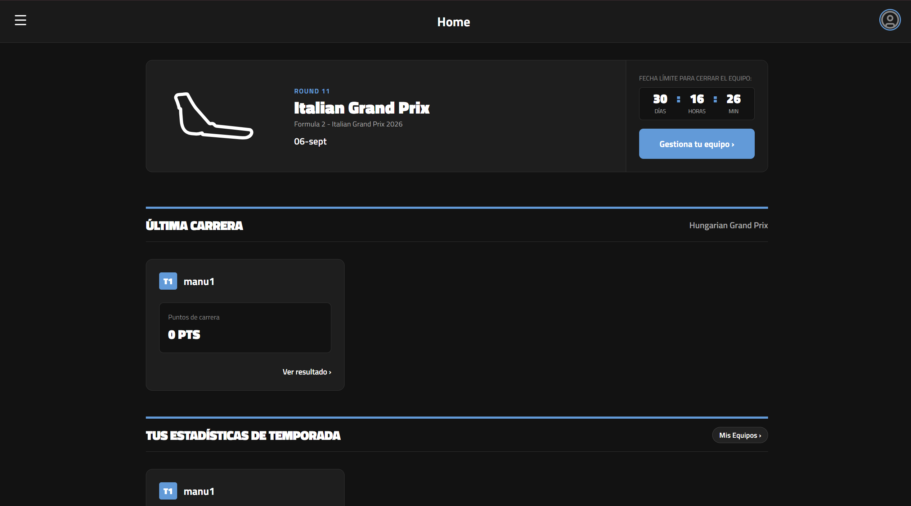
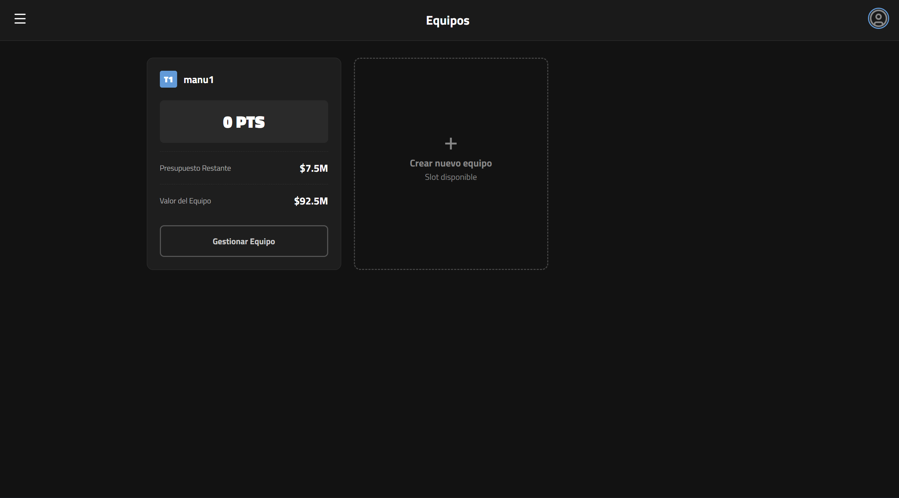
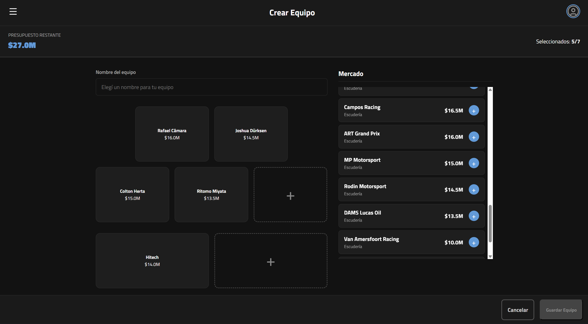
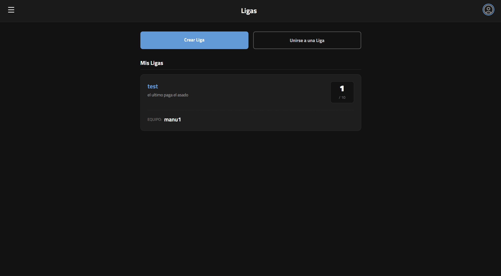
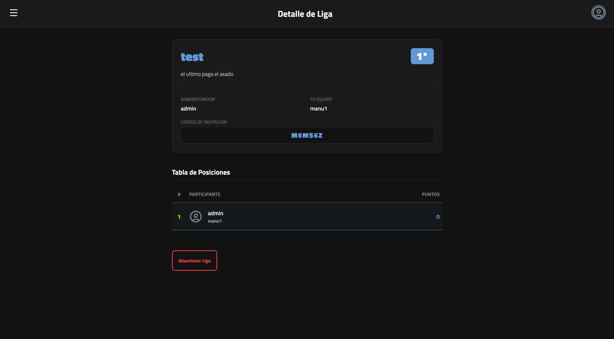
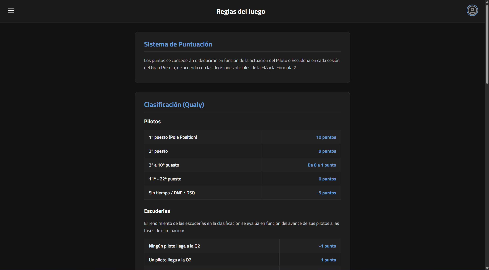
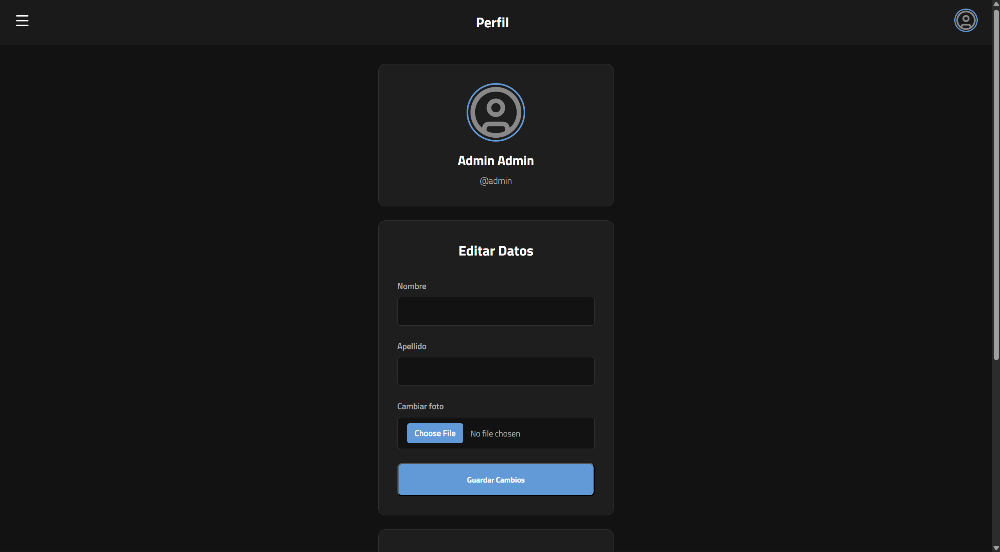

# F2 Fantasy - Documentación y Guía del Proyecto

> **Plataforma web de Liga de Fantasía para el Campeonato de Fórmula 2**  
> *Gestioná tu propio equipo, competí en ligas públicas y privadas, y seguí la temporada de F2 en tiempo real.*

---

## Tabla de Contenidos

1. [Descripción del Proyecto](#descripción-del-proyecto)
2. [Características Principales](#características-principales)
3. [Requisitos Previos](#-requisitos-previos)
4. [Configuración del Entorno](#configuración-del-entorno)
5. [Cómo Levantar el Sistema](#cómo-levantar-el-sistema)
   - [Opción A: Mediante Make (Recomendado)](#opción-a-mediante-make-recomendado)
   - [Opción B: Mediante Docker Compose](#opción-b-mediante-docker-compose)
6. [Acceso a la Aplicación](#acceso-a-la-aplicación)
7. [Comandos Útiles de Mantenimiento](#comandos-útiles-de-mantenimiento)
8. [Arquitectura del Sistema](#arquitectura-del-sistema)

---

## Descripción del Proyecto

**F2 Fantasy** es una aplicación web interactiva diseñada para los entusiastas del automovilismo y la Fórmula 2. Asume el rol de Director de Equipo (*Team Principal*), administra un presupuesto ficticio y selecciona a tus pilotos y constructores favoritos para competir contra otros usuarios a lo largo de la temporada oficial.

---

## Características Principales

* **Gestión de Equipos:** Crea y edita tu alineación respetando el presupuesto límite establecido.
* **Ligas Privadas y Públicas:** Compite en ligas globales o crea una liga privada con código de invitación para jugar con tus amigos.
* **Estadísticas y Tiempos:** Consulta resultados de las carreras, puntos acumulados y clasificación de la temporada.
* **Autenticación Segura:** Sistema completo de registro e inicio de sesión con tokens JWT y contraseñas encriptadas.
* **Roles de Usuario:** Gestión diferenciada para usuarios regulares y administradores.

---

## Requisitos Previos

Asegúrate de contar con las siguientes herramientas instaladas en tu sistema antes de comenzar:

* **Docker** & **Docker Desktop** (con soporte para Docker Compose)
* **Make** *(Opcional, altamente recomendado para ejecutar comandos abreviados)*

---

## Configuración del Entorno

### 1. Clonar el Repositorio
```bash
git clone <URL_DEL_REPOSITORIO>
cd f2fantasy
```

### 2. Configurar Variables de Entorno
Crea un archivo `.env` en la raíz del proyecto. Puedes guiarte del siguiente bloque con los valores por defecto:

```env
# ----------------------------------
# Puertos de la Aplicación
# ----------------------------------
BACK_PORT=5000
FRONT_PORT=3000

# ----------------------------------
# Configuración de Base de Datos (PostgreSQL)
# ----------------------------------
DB_USER=postgres
DB_PASSWORD=password
DB_HOST=db
DB_PORT=5432
DB_NAME=f2fantasy_db
JWT_SECRET=firma_secreta_f2

# ----------------------------------
# Administrador Inicial por Defecto
# ----------------------------------
ADMIN_USER=admin
ADMIN_PASSWORD=admin123
```

---

## Cómo Levantar el Sistema

Podés iniciar la aplicación eligiendo cualquiera de las dos alternativas siguientes:

### Opción A: Mediante Make (Recomendado)

Si disponés de `make` instalado en tu sistema, ejecuta:

```bash
# Levantar todos los servicios en segundo plano (Database, Backend y Frontend)
make up
```

Para detener los contenedores:
```bash
make down
```

### Opción B: Mediante Docker Compose

Si preferís usar los comandos nativos de Docker:

```bash
# Construir imágenes e iniciar contenedores
docker compose up -d --build
```

Para detener todos los servicios:
```bash
docker compose down
```

---

## Acceso a la Aplicación

Una vez iniciados los servicios, accedé desde tu navegador web:

| Servicio | URL / Dirección | Detalles |
| :--- | :--- | :--- |
| **Frontend Web** | `http://localhost:3000` | Interfaz de usuario de la aplicación |
| **API Backend** | `http://localhost:5000/api` | Endpoint base de la API REST |
| **Base de Datos** | `localhost:5432` | PostgreSQL 17 |

### Credenciales de Administrador (Por Defecto)
El backend inicializa automáticamente una cuenta administrativa al arrancar por primera vez:

* **Usuario:** `admin`
* **Contraseña:** `admin123`

---

## Comandos Útiles de Mantenimiento

Utiliza las metas definidas en el `Makefile` para facilitar las tareas de desarrollo y depuración:

| Comando | Descripción |
| :--- | :--- |
| `make logs` | Muestra los logs en tiempo real del servicio backend. |
| `make db-terminal` | Inicia una terminal interactiva `psql` dentro de la base de datos. |
| `make reset` | Reinicia los contenedores preservando la información almacenada en PostgreSQL. |
| `make reset-all` | **¡Atención!** Elimina la base de datos por completo y la reinicializa desde cero (`init.sql`). |
| `make up-back` | Levanta únicamente el backend y la base de datos. |
| `make up-front` | Levanta únicamente el contenedor del frontend. |

---

## Arquitectura del Sistema

```text
  [ Cliente / Navegador ]
             │
             ▼
     ┌───────────────┐
         Frontend       (Puerto 3000 - SPA React/HTML)
     └───────┬───────┘
             │  Peticiones HTTP con JWT
             ▼
     ┌───────────────┐
          Backend        (Puerto 5000 - Node.js + Express)
     └───────┬───────┘
             │  Consultas SQL
             ▼
     ┌───────────────┐
       Base de Datos    (Puerto 5432 - PostgreSQL 17)
     └───────────────┘
```

* **Frontend:** Aplicación web cliente servida en el puerto `3000`. Consume la API mediante llamadas asíncronas y gestiona el token JWT guardado en `localStorage`.
* **Backend:** Servidor REST desarrollado en Node.js y Express (puerto `5000`). Implementa `jsonwebtoken` para autenticación y `bcrypt` para el cifrado seguro de passwords.
* **Base de Datos:** Motor PostgreSQL 17 orquestado en contenedor Docker, con volumen persistente (`pgdata`) y script de arranque `init.sql`.

---

## Capturas de Pantalla

### Inicio / Home


### Alineación de Equipos


### Gestión y Configuración de Equipos


### Explorador de Ligas


### Vista de Liga y Clasificación


### Reglas y Sistema de Puntuación


### Perfil de Usuario


---

*Proyecto F2 Fantasy — Guía de documentación e instalación.*
